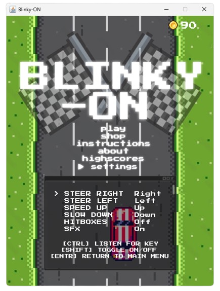

  
  
  
  

<h1>Blinky-ON: A Traffic Racing Game</h1>

Natalie Wong | January 21, 2024

Blinky-ON is a dynamic, pausable single-player game that utilizes the
arrow keys to navigate a vehicle through busy one-way traffic. 
It is developed using Java Swing and includes various intermediate concepts
explored in ICS4U, such as OOP and dynamic data structures. 

<h3>Inspiration</h3>
This ICS4U ICU project is heavily inspired by Traffic Racer, a mobile game developed and published by Skgames.

<h3>Instructions</h3>
<ul>
  <li>Utilize your arrow keys to navigate your vehicle (customizable in settings) and between menus </li>
  <li>Press ESC to pause mid-game</li>
</ul>

<h3>Features</h3>
<ul>
  <li>Collect coins to unlock new cars — The more expensive a vehicle is, the greater its steering speed!</li>
  <li>Look out for powerups! <ul>
    <li>Invincibility: The player becomes invulnerable for a short period</li>
    <li>2X Coins: The value of all coins the player gathers within a set time period is doubled</li>
    <li>Dash: The player may accelerate extraordinarily and collect a great amount of coins!</li>
  </ul></li>
  <li>Compete against your peers by accessing your top 10 highscores in the menu!</li>
</ul>

<h3>Thank you and enjoy!</h3>
