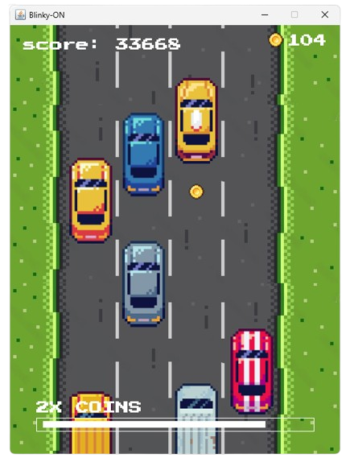

  
  

<h1>ICS4U ISU: Blinky-ON</h1>
Natalie Wong | January 21, 2024

Blinky-ON is a dynamic, pausable single player game that utilizes the
arrow keys to navigate a high-speed car through busy one-way traffic.

<h3>HINTS:</h3>

- Leave extra space between the corners of the cars when maneuvering to avoid
  collision! (due to image's width and height)
- Utilizing a car with a higher steering speed is not always better!
- In similarity to reality, cars may suddenly slow down to compensate for
  a slower car in front of it. Drive CAREFULLY and beware of this!
- The DASH powerup may be beneficial but risky!
  A vehicle may be in front of you but out of your line of sight - Use at your own risk!
  (NOT A "BUG MADE FEATURE"!!!! - the DASH powerup would have been too overpowered without it)

<h3>HAVE FUN!</h3>
